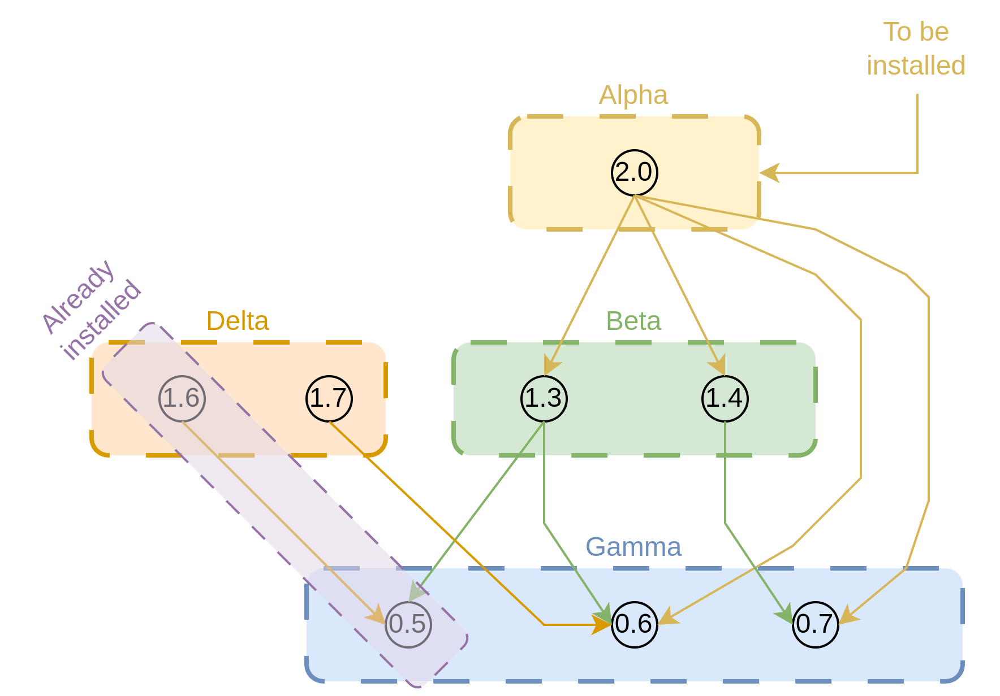

# Boolean Propositional Logic for software installations

Have you ever worked on a software development project, whether it was a small personal project to learn new skills or a large application running in production? If yes, then you have most likely used a package manager to install libraries or dependencies. 

In this blog post, we explore how `Boolean Propositional Logic` can be used for package management within software development. To make things more interactive, we have also included a [small game](https://anp-scp.github.io/package_resolving_game/){:target="_blank"} where you can act as a package manager yourself.

<!-- more -->

???+ info "What is a Boolean Propositional Formula?"

    A Boolean Propositional formula consists of variables $x_1, \dots , x_n$ and can be one of the following:
      
    1. True
    2. False
    3. $x_i$ for some $i$
    4. $\neg x_i$ for some $i$; if $x_i = True$ for some $i$, then $\neg x_i = False$
    5. $F \lor G$ where F and G are formulas. This is referred to as `OR` or disjunction
    6. $F \land G$ where F and G are formulas. This is referred to as `AND` or conjunction
    7. $F \implies G$ where F and G are formulas. This is referred to as implication, which is equivalent to $\neg F \lor G$

## What is a package manager?

A package manager is like an app store for developers, but instead of downloading games or social media apps, it helps them download pieces of code (called packages) that someone else has already written to solve common problems. They can now use this downloaded code to build new stuff upon it.

Imagine you're cooking a complex meal. You need salt, pepper, pasta, sauce, etc. Instead of growing tomatoes or grinding flour yourself, you just go to the store and buy what you need.

A package manager is that store for developers. It helps them:

- **Find** the ingredients (code libraries) they need.
- **Download** and **install** them quickly.
- **Keep them up to date**.
- **Make sure all ingredients work well together** (handle compatibility).

Here, we proceed with an example of a package manager named `conda`. However, the same concepts apply to many other package managers as well.
Say, we want to install a package named `numpy` via the `conda` package manager. We do this via `conda install numpy` :

<figure class="video_container">
  <video controls="true" allowfullscreen="true">
    <source src="/assets/blogs/june_2025/boolean_package/final.webm" type="video/webm">
  </video>
</figure>

The above video shows what happens after we enter the command `conda install numpy` in a terminal. But, where is the boolean logic involved here? Do you observe the list of other packages populated by `conda` that it wants to install? These are the packages that are kind of prerequisites for the `numpy` package to work properly and are called dependencies. A Boolean formula is used to determine this list of packages. Let us explore how the Boolean formula is leveraged here and if the task is as easy as it looks in the video above.

## Scenario

Say, we want to install a package named `Alpha` with version `2.0` (together, we refer to it as `Alpha-2.0`). The developers of `Alpha-2.0` specify that their package uses functionalities from the following other packages:

1. Beta; either of `Beta-1.3` or `Beta-1.4` works.
2. Gamma; either of `Gamma-0.6`  or `Gamma-0.7` works.

Based on the above specification, we say that `Alpha-2.0` depends on `Beta` with version `1.3` or `1.4` and on `Gamma` with version `0.6` or `0.7`.

However, the developers of `Beta` specify that their package is also dependent on the functionalities of `Gamma` in the following manner:

1. `Beta-1.3` is dependent on `Gamma-0.5`.
2. `Beta-1.4` is dependent on `Gamma-0.6`.

???+ info

    When we say that `alpha-2.0` depends on either `Beta-1.3` or `Beta-1.4`, it could be that `alpha-2.0` uses the functionalities common to both `Beta-1.3` and `Beta-1.4` and not the ones that are new in `Beta-1.4`. So, we can either install `Beta-1.3` or `Beta-1.4`, but not both at the same time.

The above dependencies can be depicted via the diagram shown in [Figure 1](#__figure-caption_1). To create the graph, we assume each version-specific package is a separate package (for example, we consider `Beta-1.3` and `Beta-1.4` as different packages) and represent them as vertices. And we create a directed edge from the package to another version-specific package on which the former depends. 

{ width="400" }

/// figure-caption
    attrs: {class: "justify_align"}
Dependency graph: A graph depicting the dependencies of the packages. Each box represents a package and each circle inside the box represents a version. We can consider each package and version combination as a different package altogether. Hence, we consider a version-specific package (e.g. Beta-1.4) as a vertex and create a directed edge from the package to another version-specific package on which the former depends on. 
///

Now, our objective is to pick the packages and versions to be installed in a way such that:

1. For each package, only one version is installed to ensure consistency.
2. All dependencies are satisfied.

Given the above conditions, we can observe in [Figure 2](#__figure-caption_2) that there are two compatible selections of packages:

1. Alpha-2.0, Beta-1.3 and Gamma-0.6
2. Alpha-2.0, Beta-1.4, and Gamma-0.7

/// figure-caption
    attrs: {class: "justify_align"}
Based on our conditions and dependencies, we can have two compatible selections: `(i) Alpha-2.0, Beta-1.3 and Gamma-0.6`, and `(ii) Alpha-2.0, Beta-1.4, Gamma-0.7`
///

Given the simplicity of the problem in terms of the number of packages and dependencies, we were able to find the selection easily and visually. But how to formally find the selection for a large number of packages and dependencies? And, how does a package manager do it? The answer is Boolean logic. So, let us now find how to transform the problem into a Boolean formula.

## Transforming dependency requirements to logical formula

***Step 1:*** We represent each version-specific package as a boolean variable, which can be either `True` or `False`. When the variable for the package is `True`, then the package is picked for installation, and if `False`, then it is not picked.  For our example, we have 6 different variables as follows: `Alpha1.0, Beta1.3, Beta1.4, Gamma0.5, Gamma0.6, and Gamma0.7`.

 

***Step 2***: Each dependency can be represented using implications. For example, if $A$ depends on $B$ then we say, $A \implies B$ which means that if $A$ is installed then $B$ must be installed and if $A$ need not be installed then it doesn’t matter if $B$ is installed or not. The dependencies in our example can be represented as follows:

1. $Alpha2.0 \implies (Beta1.3 \lor Beta1.4)$
2. $Alpha2.0 \implies (Gamma0.6 \lor Gamma0.7)$
3. $Beta1.3 \implies (Gamma0.5 \lor Gamma0.6)$
4. $Beta1.4 \implies Gamma0.7$

***Step 3:*** To ensure that we have exactly one version of each package, we negate conjunctions of each unordered pair of versions of the same package. Say we have a package `A` with versions 1 and 2. The boolean formula to ensure a single version would be $\neg (A1 \land A2)$, This ensures that $A1$ and $A2$ cannot be simultaneously `True`. For our example, we have the following conjunctions:

1. $\neg (Beta1.3 \land Beta1.4)$
2. $\neg (Gamma0.5 \land Gamma0.6)$
3. $\neg (Gamma0.6 \land Gamma0.7)$
4. $\neg (Gamma0.5 \land Gamma0.7)$

Now, if we create a conjunction of all four formulas above, we ensure that no two versions of the package become `True` or get installed at the same time. The conjunction of the above four terms would look like:

$$
\neg (Beta1.3 \land Beta1.4) \land \neg (Gamma0.5 \land Gamma0.6) \land   
\neg (Gamma0.6 \land Gamma0.7) \land  \neg (Gamma0.5 \land Gamma0.7)
$$

***Step 4:*** Now we create a conjunction of all the terms in `Step 1`, `Step 2`, and `Step 3`, which will result in the following formula:

$$
[Alpha2.0 \implies (Beta1.3 \lor Beta1.4)] \land \\
[Alpha2.0 \implies (Gamma0.6 \lor Gamma0.7)] \land \\
[Beta1.3 \implies (Gamma0.5 \lor Gamma0.6)] \land \\
(Beta1.4 \implies Gamma0.7) \land \\
\neg (Beta1.3 \land Beta1.4) \land \neg (Gamma0.5 \land Gamma0.6) \land \\
\neg (Gamma0.6 \land Gamma0.7) \land  \neg (Gamma0.5 \land Gamma0.7)
$$

***Step 5:*** The most important point is that `Alpha-2.0` must be installed. Hence, the variable corresponding to it must always be assigned `True` i.e $Alpha2.0 = True$. So, we create a conjunction of $Alpha2.0$ with the formula in step 4:

$$
Alpha2.0 \land [Alpha2.0 \implies (Beta1.3 \lor Beta1.4)] \land \\
[Alpha2.0 \implies (Gamma0.6 \lor Gamma0.7)] \land \\
[Beta1.3 \implies (Gamma0.5 \lor Gamma0.6)] \land \\
(Beta1.4 \implies Gamma0.7) \land \\
\neg (Beta1.3 \land Beta1.4) \land \neg (Gamma0.5 \land Gamma0.6) \land \\
\neg (Gamma0.6 \land Gamma0.7) \land  \neg (Gamma0.5 \land Gamma0.7)
$$

Now, we just want an assignment of boolean values to each of the variables such that the formula evaluates to `True`. Packages corresponding to variables with `True` values will be selected for installation. This problem of finding a possible assignment of values to the Boolean variables such that the formula evaluates to `True` is called the `Functional Boolean Satisfiability (FSAT) Problem`. A simple extension/simplification of the problem is to decide if a Boolean formula is satisfiable or not, which is known as the `Boolean Satisfiability (SAT) Problem`.  If we can find a solution for an instance of the FSAT problem, then we can say that the boolean formula is satisfiable, and if we can’t, we say the formula is unsatisfiable.

Before thinking about how to solve the problem, let us first verify if a solution (compatible selection of packages) we found in [Figure 2](#__figure-caption_2) evaluates to `True`. Since the formula is quite long, we will evaluate each term of the conjunction separately and then evaluate the final result. For the conjunction to be `True`, all the terms need to be `True`; otherwise, the whole formula would evaluate to `False`.

***Compatible Selection 1:***

$$
\begin{array}{|c |c |}\hline
Variable & Value \\\hline
Alpha2.0    &    True       \\Beta1.3     &    True       \\Beta1.4     &    False      \\Gamma0.5    &    False      \\Gamma0.6    &    True       \\Gamma0.7    &    False       \\\hline\end{array}
$$

/// table-caption
    attrs: {class: "justify_align"}
Values assigned to each variable as per compatible selection 1
///

$$
\begin{array}{|c | c |c |}\hline\textbf{Term} & \textbf{Evaluation} & \textbf{Result} \\\hline\text{Alpha2.0} \implies (\text{Beta1.3} \lor \text{Beta1.4}) & \text{True} \implies (\text{True} \lor \text{False}) & \text{True} \\\hline
\text{Alpha2.0} \implies (\text{Gamma0.6} \lor \text{Gamma0.7}) & \text{True} \implies (\text{True} \lor \text{False}) & \text{True} \\\hline
\text{Beta1.3} \implies (\text{Gamma0.5} \lor \text{Gamma0.6}) & \text{True} \implies (\text{False} \lor \text{True}) & \text{True} \\\hline
\text{Beta1.4} \implies \text{Gamma0.7} & \text{False} \implies \text{False} & \text{True} \\\hline
\neg (\text{Beta1.3} \land \text{Beta1.4}) & \neg (\text{True} \land \text{False}) & \text{True} \\\hline
\neg (\text{Gamma0.5} \land \text{Gamma0.6}) & \neg (\text{False} \land \text{True}) & \text{True} \\\hline
\neg (\text{Gamma0.6} \land \text{Gamma0.7}) & \neg (\text{True} \land \text{False}) & \text{True} \\\hline
\neg (\text{Gamma0.5} \land \text{Gamma0.7}) & \neg (\text{False} \land \text{False}) & \text{True} \\\hline
\text{Alpha2.0} & \text{True} & \text{True} \\\hline\end{array}
$$

/// table-caption
    attrs: {class: "justify_align"}
Evaluation of the statement based on compatible selection 1. Since all the terms evaluate to True, the selection is correct.
///   

We can observe in [Table 2](#__table-caption_2) that all the terms evaluate to `True`, which means the selection of the packages is indeed correct and satisfies our requirements.

***An Incompatible Selection***:

Now, let us try an incompatible selection as visualized in [Figure 3](#__figure-caption_3), where `Gamma-0.5` is selected but `Alpha-2.0` depends on `Gamma` with versions > 0.5, which is contradictory (note that we can select only one version of each package). Let us see how our Boolean formula detects this.

{ width="400" }

/// figure-caption
    attrs: {class: "justify_align"}
An incompatible selection of packages. It is so because we select `Gamma-0.5` but `Alpha-2.0` needs `Gamma` with version > 0.5. As we cannot install multiple versions of the same package, this selection makes it incompatible.
///

$$
\begin{array}{|c |c |}\hline
Variable & Value \\\hline
Alpha2.0    &    True       \\Beta1.3     &    True       \\Beta1.4     &    False      \\Gamma0.5    &    True      \\Gamma0.6    &    False       \\Gamma0.7    &    False       \\\hline\end{array}
$$

/// table-caption
    attrs: {class: "justify_align"}
Values assigned to each variable as per the incompatible selection in [Figure 3(#__figure-caption_3)].
/// 

$$
\begin{array}{|c | c |c |}\hline\textbf{Term} & \textbf{Evaluation} & \textbf{Result} \\\hline\text{Alpha2.0} \implies (\text{Beta1.3} \lor \text{Beta1.4}) & \text{True} \implies (\text{True} \lor \text{False}) & \text{True} \\\hline
\text{Alpha2.0} \implies (\text{Gamma0.6} \lor \text{Gamma0.7}) & \text{True} \implies (\text{False} \lor \text{False}) & \text{False} \\\hline
\text{Beta1.3} \implies (\text{Gamma0.5} \lor \text{Gamma0.6}) & \text{True} \implies (\text{True} \lor \text{False}) & \text{True} \\\hline
\text{Beta1.4} \implies \text{Gamma0.7} & \text{False} \implies \text{False} & \text{True} \\\hline
\neg (\text{Beta1.3} \land \text{Beta1.4}) & \neg (\text{True} \land \text{False}) & \text{True} \\\hline
\neg (\text{Gamma0.5} \land \text{Gamma0.6}) & \neg (\text{True} \land \text{False}) & \text{True} \\\hline
\neg (\text{Gamma0.6} \land \text{Gamma0.7}) & \neg (\text{False} \land \text{False}) & \text{True} \\\hline
\neg (\text{Gamma0.5} \land \text{Gamma0.7}) & \neg (\text{True} \land \text{False}) & \text{True} \\\hline
\text{Alpha2.0} & \text{True} & \text{True} \\\hline\end{array}
$$

/// table-caption
    attrs: {class: "justify_align"}
Evaluation of the statement based on the incompatible selection. Since one term evaluates to False, the whole conjunction will lead to False, and the selection would be marked as incorrect.
///

We can observe in [Table 4](#__table-caption_4) that the formula detects the incompatibility described in [Figure 3](#__figure-caption_3) as the implication $Alpha2.0 \implies (Gamma0.6 \lor Gamma0.7)$ becomes `False` making the whole formula `False` due to conjunction. The task of the package manager is to avoid such assignments.

Now, let us see an unsatisfiable situation that leads to an unsatisfiable instance of the SAT problem.

***An unsatisfiable situation***

/// figure-caption
    attrs: {class: "justify_align"}
An unsatisfiable situation where `Gamma-0.5` is already installed in the system as it is a dependency of the already installed package `Delta-1.6`. This leads to the incompatible selection as described in [Figure 3](#__figure-caption_3) as the variable for `Gamma-0.6` will always be set to `True`.
///

As visualized in [Figure 4](#__figure-caption_4), let us assume that some package named `Delta-1.6`, which depends on `Gamma-0.5`, is already installed in our system, and we now need to install `Alpha-2.0`. Since `Delta-1.6` depends on `Gamma-0.5` , $Gamma0.5$ will always be `True`. This will lead to the same situation as shown in [Figure 3](#__figure-caption_3), making this instance of the problem unsatisfiable. In such cases, the package manager would ask the user to upgrade `Delta-1.6` to `Delta-1.7`. If users upgrade `Delta`, then `Gamma-0.5` would be upgraded to `Gamma-0.6`. This will make the problem satisfiable with the solution same as the 1st compatible selection shown in [Figure 2](#__figure-caption_2).

When the `conda` package manager finds such feasible options, it would prompt the user for such an upgrade, as shown in [Figure 5](#__figure-caption_5). 

/// figure-caption
    attrs: {class: "justify_align"}
A representative example where `conda` package manager prompts user if it is fine to upgrade `delta` and `gamma` in order to install `alpha-2.0`.
///

When there is no option for upgrading/downgrading in an unsatisfiable situation, package manager would raise error stating that the requirements are not satisfiable. Check [Figure 6](#__figure-caption_6) for an example of such a situation with the `conda package manager`.

/// figure-caption
    attrs: {class: "justify_align"}
`Conda` raising an unsatifiable error as it finds an unsatisfiable conditions. Th user tries to install `numpy-1.15.4` which depends on `python` with versions `>=2.7,<2.8.0a0`, `>=3.6,<3.7.0a0`, and `python >=3.7,<3.8.0a0`. However, another dependency of `numpy` is `pin-1` depends on `python-3.10` which conflicts with the previously reported requirements of `python`.
///

## :material-gamepad-variant: Game time !!!

Wan't to try your hands at solving the SAT problem for dependency resolution? Check the following game for more hands-on examples. Check how boolean logic can help in finding constraints.

Game: [Package Dependency Resolution Game](https://anp-scp.github.io/package_resolving_game/){:target="_blank"}

## Regarding solving the SAT problem

Before discussing solving the SAT problem, first let us discuss verifying if a given solution satisfies the Boolean formula. In the previous section, we verified multiple assignments of boolean variables to check if they satisfy the boolean formula. It can be observed that the number of computations needed to verify the assignment is proportional to the number of operators in it, which is similar to the number of literals in the formula. (NOTE: A literal is some boolean variable $x_i$ or its negation $\neg x_i$). 

If we express the time taken to verify the boolean formula with $n$ literals as the number of computation performed, then the time to verify a SAT formula would be some linear function of $n$, which would be a polynomial (as we need to iterate though the operands and replace it with result of the operands until we get the final result). We can think of a sequence of operations that can be performed in polynomial time as a fast algorithm (let us refer to the sequence of operations as an algorithm). Such problems are considered to be a part of a class of problems named `p`. So, verification of a Boolean formula given an assignment comes under the `p` class of problems.

Now, let us discuss how to find an assignment of the variables. The most naive way would be to try all possible assignments. But this would be exponential in terms of the number of variables. The larger the number of variables, the longer it takes to find an assignment. But, do we have an algorithm that can find an assignment in polynomial time instead of exponential time? Interestingly, the current experience of mathematicians is that there is no such algorithm. However, there exist implementations of heuristic SAT solvers that can find satisfying assignments in a reasonable time, and tons of research is done in developing such algorithms. Discussion of those algorithms is out of the scope of this blog due to my limited knowledge in that area. But, the good news is we can use those implementations to solve our problem of selecting the appropriate dependencies. In addition to this, the implementations also provide recommendations to make the problem satisfiable if it is not, as seen in the situation described in [Figure 4](#__figure-caption_4). For example, `conda` uses some implementations like `PicoSAT` and `libsolv`. If you are comfortable in Python, you may check PySAT, which provides an implementation of SAT solvers in Python.

## How difficult is the SAT problem?

???+ info "What is reduction?"
    
    If we can transform one problem `A` into another problem `B` in polynomial time, we say that problem `A` is reduced to problem `B`. If we find a polynomial time algorithm for `B`, we will have a polynomial time algorithm for `A` too by first transforming `A` to `B` and then solving for `B`. For example, our problem of finding the correct selection of packages has been transformed into a SAT problem in polynomial time. We just had to write boolean formulas for each condition, and doing so is equivalent to doing tasks with a number of operations as some constant times the number of conditions, which would be linear in the number of conditions.
    

As of now, we don’t have a polynomial time algorithm for solving the SAT problem, but we saw that given a solution, the verification can be done in polynomial time, and such problems with polynomial time verification are said to be in the class named `np`. An interesting fact about the SAT problem is that any other problem in `np` can be reduced to SAT in polynomial time. One such example is our problem of selecting appropriate packages that satisfy all dependencies. That means if we have a polynomial time algorithm to solve SAT, then we have a polynomial time algorithm for all other problems in `np`. Mathematicians ***believe*** that there is no such algorithm, and nobody has been able to ***prove*** this yet. But if one can find such an algorithm, then not only will installing a package become fast, but it will also lead to crazy consequences. Check [this video](https://www.youtube.com/watch?v=6OPsH8PK7xM){:target="_blank"} for more information on this.

## Other Applications of Boolean Propositional Logic

There are many other applications of boolean formulas in everyday life. We list a couple of them below.

### Access Control Policies
Used to define and enforce access rules in computer systems based on roles, permissions, and environmental conditions.

**Examples:**

- Grant access if the user is an admin or has read permission:  
  $ (\text{Admin} \lor \text{ReadPermission}) \implies \text{Access}$

- Deny access during lockdown:  
  $ \text{Lockdown} \implies \neg \text{ Access }$

- A guest and admin role cannot be assigned together:  
  $ \neg (\text{ Guest } \land \text{ Admin })$

### Course Prerequisites and Scheduling

Used in academic planning tools to ensure students meet course prerequisites and avoid scheduling conflicts.

**Examples:**

- Taking CS201 requires completing CS101:  
  $ \text{CS201} \implies \text{CS101}$

- Prevent scheduling overlap between Bio101 and Chem101:  
  $ \neg  (\text{Bio101} \land \text{Chem101})$

- Choose only one from three electives:  
  $ (\text{E1} \lor \text{E2} \lor \text{E3}) \land \neg (\text{E1} \land \text{E2}) \land \neg (\text{E1} \land \text{E3}) \land \neg (\text{E2} \land \text{E3})$

### Resource Management by Operating Systems

Used to manage allocation of resources like CPU, memory, and Input/Output (I/O) devices in a computer system without conflicts or deadlocks.

**Examples:**

- A process can run only if it has both CPU and memory available:  
  $ (\text{HasCPU} \land \text{HasMemory}) \implies \text{CanRun}$

- Two processes cannot write to the same file simultaneously:  
  $ \neg (\text{Write(P1, FileX)} \land \text{Write(P2, FileX)})$
  Here, $P1$ and $P2$ are two processes or software running in a computer system, and $FileX$ is a file.

- Deadlock detection rules:

    Imagine a system with:

    - Two processes: P1 and P2
    - Two resources: R1 and R2

    Scenario:

    - P1 holds R1 and is waiting for R2. P1 will never reach to completion if it doesn't get R2.
    - P2 holds R2 and is waiting for R1. P2 will never reach to completion if it doesn't get R1.

    This creates a circular wait, which is one of the conditions for deadlock. Let’s define Boolean variables:

    - Hold(Pi, Rj) would be True if Pi holds Rj for some usage
    - Wait(Pi, Rj) would be True if Pi is waiting for Rj to be released by some other process
  
  Now the following formula can be used to detect potential deadlocks:
  $ (\text{Hold}(P1, R1) \land \text{Wait}(P1, R2) \land \text{Hold}(P2, R2) \land \text{Wait}(P2, R1) ) \implies \text{Deadlock}$

## References:

1. [Dependency Resolution Made Simple](https://borretti.me/article/dependency-resolution-made-simple){:target="_blank"}
2. [The Magic of Dependency Resolution](https://ochagavia.nl/blog/the-magic-of-dependency-resolution/){:target="_blank"}
3. [Version SAT](https://research.swtch.com/version-sat){:target="_blank"}
4. [Deep Dive into Conda Install](https://docs.conda.io/projects/conda/en/4.13.x/dev-guide/deep-dive-install.html#deep-dive-install){:target="_blank"}
5. [Deep dive: solvers](https://docs.conda.io/projects/conda/en/4.13.x/dev-guide/deep-dive-solvers.html){:target="_blank"}
6. [LibMamba vs Classic](https://conda.github.io/conda-libmamba-solver/user-guide/libmamba-vs-classic/){:target="_blank"}